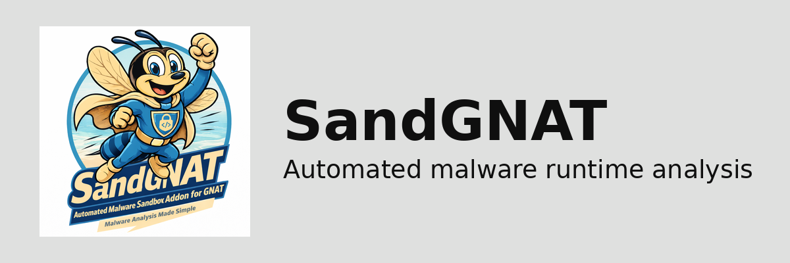

<p align="center">
  
</p>

# SandGNAT

Automated malware runtime-analysis environment: detonate suspicious binaries in
isolated Windows VMs, capture behavioural artifacts (registry deltas, file I/O,
network traffic, process trees), and emit STIX 2.1 objects into PostgreSQL.

**Full documentation:** [`docs/`](docs/) — organised by the
[Diátaxis](https://diataxis.fr/) framework (tutorials, how-to guides,
reference, explanation). Rendered at
[wrhalpin.github.io/SandGNAT](https://wrhalpin.github.io/SandGNAT/).

**Canonical design:** [`docs/MALWARE_ANALYSIS_SYSTEM_DESIGN.md`](docs/MALWARE_ANALYSIS_SYSTEM_DESIGN.md)

**Quick starting points:**

- New here? → [tutorials/01-your-first-sample.md](docs/tutorials/01-your-first-sample.md)
- Setting up a dev stack? → [tutorials/02-local-dev-stack.md](docs/tutorials/02-local-dev-stack.md)
- Architecture tour? → [explanation/architecture.md](docs/explanation/architecture.md)
- API reference? → [reference/http-api.md](docs/reference/http-api.md)

## Repository layout

```
.
├── assets/logo/                  Brand assets (favicon, social card, etc.)
├── docs/                         Design docs + Diátaxis documentation site
├── migrations/                   Postgres schema (versioned SQL)
├── orchestrator/                 Python job orchestrator (Celery)
│   ├── config.py                 Environment-backed settings
│   ├── db.py                     psycopg connection pool
│   ├── models.py                 Dataclasses for job/artifact rows
│   ├── schema.py                 Shared host <-> guest wire schema (stdlib only)
│   ├── stix_builder.py           STIX 2.1 object factories + bundle export
│   ├── proxmox_client.py         Proxmox API wrapper (VM lifecycle)
│   ├── vm_pool.py                DB-backed VM pool manager (lease + reap)
│   ├── guest_driver.py           Stages samples, publishes jobs, waits for results
│   ├── analyzer.py               Turns guest artifacts into STIX + normalised rows
│   ├── static_analysis.py        Parses Linux static-guest envelope into a bundle
│   ├── trigrams.py               Byte/opcode trigrams + MinHash + LSH bands (stdlib)
│   ├── similarity.py             LSH-banded similarity lookup + short-circuit
│   ├── persistence.py            Writes STIX + metadata + signatures to Postgres
│   ├── intake.py                 Sample intake pipeline (validate/hash/VT/YARA/enqueue)
│   ├── intake_api.py             Flask HTTP front-end for submissions
│   ├── intake_server.py          CLI entry point for the intake service
│   ├── vt_client.py              VirusTotal v3 hash-lookup client (no upload)
│   ├── yara_scanner.py           Optional YARA pre-classification
│   ├── export_api.py             Read-only Flask blueprint for GNAT connector
│   ├── tasks.py                  Celery tasks (analyze_malware_sample)
│   ├── tasks_static.py           Celery static_analyze_sample (Linux pre-stage)
│   └── parsers/                  Artifact parsers (ProcMon, RegShot, PCAP)
├── linux_guest_agent/            Linux static-analysis guest (stdlib + opt-in deps)
│   ├── watcher.py                Polls staging share for static_analysis jobs
│   ├── runner.py                 Per-job static toolchain orchestration
│   └── tools/                    PE/ELF, fuzzy, strings/entropy, YARA, CAPA, trigrams
├── guest_agent/                  Windows-side collector (stdlib only, PyInstaller-friendly)
│   ├── config.py                 Env-backed guest settings
│   ├── watcher.py                Polls staging/pending, claims jobs atomically
│   ├── runner.py                 Per-job capture + detonate + package pipeline
│   ├── executor.py               Runs samples under a hard timeout
│   └── capture/                  Wrappers for ProcMon, tshark, RegShot, drop detection
├── infra/
│   ├── opnsense/                 Firewall rule exports / templates
│   └── guest/                    Windows guest prep + capture scripts
├── tests/                        Unit tests (schema, parsers, analyzer, guest_driver)
└── pyproject.toml                Python project metadata
```

## Quick start (orchestrator development)

```bash
python -m venv .venv && source .venv/bin/activate
pip install -e '.[dev]'

# Apply schema to local Postgres (run migrations in order)
psql "$DATABASE_URL" -f migrations/001_initial_schema.sql
psql "$DATABASE_URL" -f migrations/002_intake_and_vm_pool.sql
psql "$DATABASE_URL" -f migrations/003_static_analysis.sql

# Run unit tests
pytest
```

## Submitting a sample

```bash
# Intake API (requires INTAKE_API_KEY in env on the server):
curl -sS -H "X-API-Key: $INTAKE_API_KEY" \
     -F "file=@/path/to/sample.exe" \
     -F "priority=3" \
     http://localhost:8080/submit

# Response:
# {"decision": "queued", "analysis_id": "...", "sha256": "...", "priority": 3, ...}

# Poll status:
curl -sS -H "X-API-Key: $INTAKE_API_KEY" \
     http://localhost:8080/jobs/<analysis_id>
```

### Submitting under a GNAT investigation

SandGNAT accepts three optional form fields that plumb a
[GNAT investigation](https://github.com/wrhalpin/GNAT) through to the
produced STIX bundle. Every object emitted by the analysis is stamped
with `x_gnat_investigation_id`, `x_gnat_investigation_origin=sandgnat`,
and `x_gnat_investigation_link_type`, and a wrapping STIX `Grouping`
is added to the front of the bundle.

```bash
curl -sS -H "X-API-Key: $INTAKE_API_KEY" \
     -F "file=@/path/to/sample.exe" \
     -F "investigation_id=IC-2026-0042" \
     -F "investigation_tenant_id=acme-co" \
     -F "investigation_link_type=confirmed" \
     http://localhost:8080/submit
```

All three are optional; `investigation_link_type` defaults to
`confirmed`. IDs must match `^[A-Za-z0-9_.:\-]+$` and be ≤ 128 chars.
Analyses submitted without an `investigation_id` are byte-identical to
the pre-investigation output — no stamping, no Grouping.

## Querying results (GNAT connector surface)

Read-only endpoints on the same service, same `X-API-Key`. These are the
contract the `gnat.connectors.sandgnat` connector consumes:

```
GET  /analyses                          list + filters, paginated.
                                        Filters: sha256, status, since,
                                                 investigation_id,
                                                 has_investigation
GET  /analyses/<uuid>                   one job row (includes investigation_*)
GET  /analyses/<uuid>/bundle            full STIX 2.1 bundle. When the job has an
                                        investigation_id, every object carries
                                        x_gnat_investigation_* and a wrapping
                                        Grouping sits at the top of objects[].
                                        409 if not completed.
GET  /analyses/<uuid>/static            static-analysis findings + fuzzy hashes
GET  /analyses/<uuid>/similar           LSH + lineage neighbours
POST /analyses/<uuid>/investigation     retroactively tag an analysis. Body:
                                        {"investigation_id":"...","link_type":
                                         "inferred","tenant_id":"..."}. 409 if
                                        already set; pass ?force=true to
                                        overwrite. The bundle is not
                                        regenerated — the tag is row metadata.
```

Example — pull every completed analysis from the last hour for one
investigation:

```bash
curl -sS -H "X-API-Key: $INTAKE_API_KEY" \
     "http://localhost:8080/analyses?status=completed&investigation_id=IC-2026-0001&since=$(date -u -d '1 hour ago' +%FT%TZ)"
```

Env knobs for intake:

| Variable                  | Purpose                                                |
|---------------------------|--------------------------------------------------------|
| `INTAKE_API_KEY`          | Shared secret for `X-API-Key` header (required)        |
| `INTAKE_BIND_HOST/PORT`   | HTTP bind address                                      |
| `INTAKE_MAX_SAMPLE_BYTES` | Hard cap on upload size (default 128 MiB)              |
| `INTAKE_YARA_RULES_DIR`   | Directory of `.yar` files to scan uploads against      |
| `VIRUSTOTAL_API_KEY`      | If set, hash-only VT pre-check (never uploads bytes)   |
| `VM_POOL_VMID_MIN/MAX`    | Proxmox vmid range for analysis clones (default 9100-9199) |
| `VM_POOL_STALE_LEASE_SECONDS` | Reap leases whose heartbeat is older than this     |

## Runtime dependencies

- PostgreSQL 15+ (JSONB GIN indices, `tsvector`)
- Redis 7+ (Celery broker)
- Proxmox VE 8+ (API token auth)
- Python 3.11+

## Status

Phases 1–6 complete:

1. Scaffold, Postgres schema, STIX factories.
2. Host↔guest detonation protocol + analyzer turning artifacts into STIX.
3. Intake service (HTTP API + VT hash pre-check + YARA) and DB-backed VM
   pool manager.
4. Linux static-analysis pre-stage with byte/opcode trigram MinHash and
   LSH-banded near-duplicate short-circuit.
5. **Read-only export API** for external consumers. The GNAT TIP connector
   (in the separate `wrhalpin/GNAT` repo) pulls completed analyses over
   HTTP — STIX bundles, per-job static findings, and similarity neighbours
   — without needing direct Postgres access.
6. **Anti-analysis evasion mitigations (phases A–G).** Proxmox-level
   template hardening, decoy-user profile seeding, renamed capture
   toolchain, user-activity simulator, MinHook-based sleep patcher,
   split-DNS INetSim + netem network realism, and a post-run
   evasion detector that flips `analysis_jobs.evasion_observed` when a
   sample tries to identify the sandbox. Rationale +
   implementation record in
   [`docs/explanation/anti-analysis-evasion.md`](docs/explanation/anti-analysis-evasion.md).

Next up: end-to-end orchestration testing against real Proxmox + Postgres,
plus push-on-completion if bulk pulling doesn't cover GNAT's ingest needs.

## License

Licensed under the Apache License, Version 2.0. See [`LICENSE`](LICENSE)
for the full text.

Every source file carries an SPDX header:

```
SPDX-License-Identifier: Apache-2.0
Copyright 2026 Bill Halpin
```

New files added to the repo should include this header at the top (as a
`#` comment for Python/PowerShell/shell, `--` for SQL).
