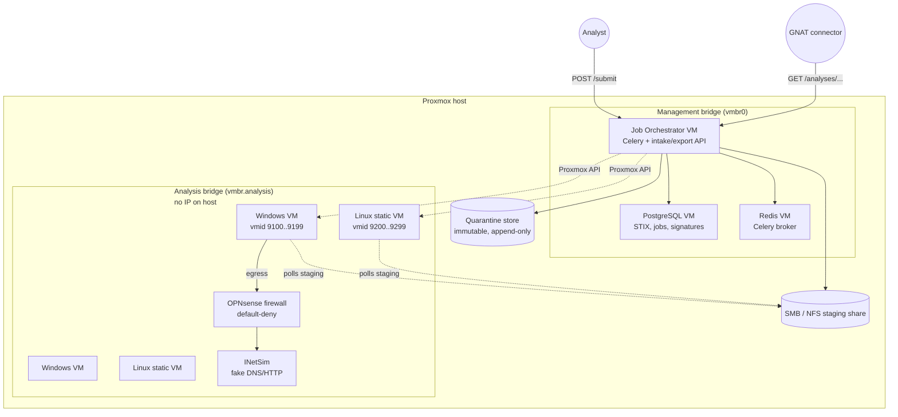
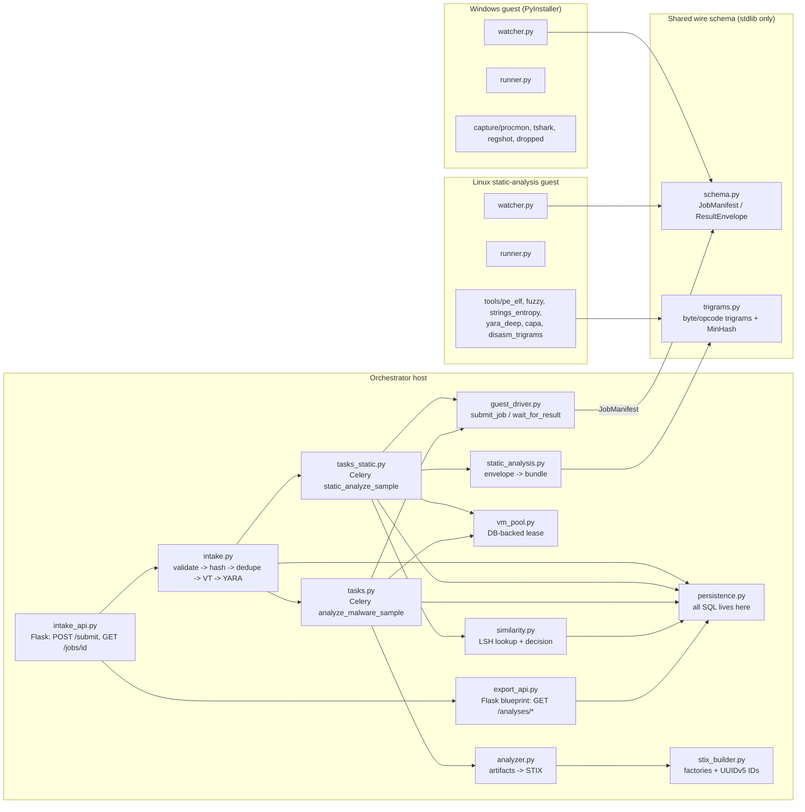
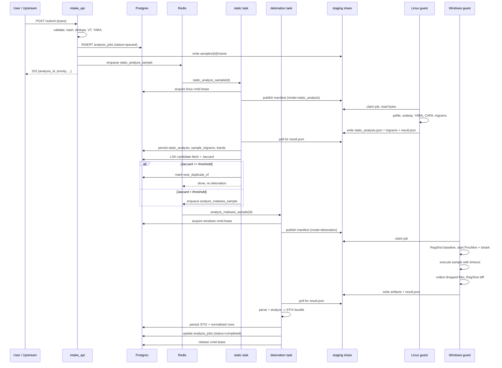

# Architecture overview

SandGNAT is a malware runtime-analysis sandbox. It takes a binary,
detonates it inside an isolated Windows VM, captures behavioural
artifacts (registry, filesystem, network, processes), and emits STIX
2.1 into PostgreSQL. A pre-detonation Linux static-analysis stage
clusters new submissions against known ones and skips detonation when a
new sample is a near-duplicate of something already analysed.

This page is the anchor for the "how does it fit together" question.
For the canonical design-of-record see
[`MALWARE_ANALYSIS_SYSTEM_DESIGN.md`](../MALWARE_ANALYSIS_SYSTEM_DESIGN.md).

## Infrastructure topology

Key isolation points:

- `vmbr.analysis` has no IP on the Proxmox host, so the host is
  unreachable from any analysis VM.
- OPNsense default-denies everything outbound; the only permitted egress
  is to INetSim (fake DNS/HTTP) and the orchestrator's SMB share.
- Windows detonation VMs get no unrestricted internet. Malware's C2
  traffic is redirected to INetSim so we observe the indicators without
  exfiltration risk.
- The orchestrator and analysis VMs never share a bridge with untrusted
  networks.

See [isolation-model.md](isolation-model.md) for the full threat model.

## Pipeline shape

A single submission traverses four stages: intake validates and stages
the sample, optionally static analysis runs first, detonation captures
dynamic behaviour, and export exposes the result to downstream
consumers.

```mermaid
flowchart LR
    Start([POST /submit]) --> Validate[Validate size + hash + dedupe]
    Validate -->|reject| Rejected([400 rejected])
    Validate -->|duplicate| Duplicate([200 duplicate])
    Validate --> VT[VT hash lookup]
    VT --> YARA[YARA scan]
    YARA --> Insert[(Insert analysis_jobs)]
    Insert --> Stage[Stage bytes to SMB share]
    Stage --> Enqueue{Static enabled?}
    Enqueue -->|no| Detonate
    Enqueue -->|yes| Static[static_analyze_sample<br/>Linux pool]
    Static --> Trigrams[Compute byte + opcode MinHash]
    Trigrams --> Similar[LSH similarity lookup]
    Similar -->|≥ threshold| ShortCircuit[Mark near-duplicate<br/>link lineage]
    Similar -->|< threshold| Detonate[analyze_malware_sample<br/>Windows pool]
    ShortCircuit --> Done
    Detonate --> Parse[Parse ProcMon + RegShot + PCAP]
    Parse --> STIX[Build STIX 2.1 bundle]
    STIX --> Persist[(Persist to Postgres)]
    Persist --> Quarantine[Move dropped files to quarantine]
    Quarantine --> Evasion[Detect anti-VM behaviour<br/>evasion_detector.py]
    Evasion --> Done([status=completed<br/>evasion_observed set])

    Done -.GET /analyses/id/bundle.-> GNATConsumer((GNAT connector))
```

## Component model

## Happy-path sequence (detonation)

## Request-time dependencies

Submissions are synchronous up to the enqueue. Actually waiting for a
detonation is minutes of queued+VM-boot+timeout+capture-export, so the
client polls `GET /jobs/<id>` or `GET /analyses/<id>` until status
becomes `completed` or `failed`.

| Step           | Typical latency      | Blocking? |
|----------------|----------------------|-----------|
| POST /submit   | 50–500 ms            | yes       |
| Static stage   | 15–120 s             | no (async) |
| Windows VM boot + detonation | 3–10 min | no (async) |
| Artifact export to SMB | 5–30 s       | no (async) |
| STIX persist + quarantine    | 1–5 s    | no (async) |
| Bundle fetch   | 20–200 ms            | yes       |

## What lives where

| Concern                         | Module                              |
|---------------------------------|-------------------------------------|
| HTTP surface                    | `intake_api.py`, `export_api.py`    |
| Input validation + prioritisation | `intake.py`                       |
| VT + YARA pre-checks            | `vt_client.py`, `yara_scanner.py`   |
| Celery tasks                    | `tasks.py`, `tasks_static.py`       |
| VM pool                         | `vm_pool.py`                        |
| Proxmox API calls               | `proxmox_client.py`                 |
| Host ↔ guest filesystem protocol | `guest_driver.py`                  |
| Wire schema (shared)            | `schema.py`                         |
| Artifact parsers (pure)         | `parsers/*.py`, `static_analysis.py` |
| STIX factories                  | `stix_builder.py`                   |
| Similarity engine               | `similarity.py`, `trigrams.py`      |
| Anti-analysis mitigations       | `guest_agent/activity/`, `guest_agent/stealth/` |
| Evasion detection (post-run)    | `evasion_detector.py`               |
| All SQL                         | `persistence.py`                    |

This split matters: parsers and STIX factories are **pure** (no DB, no
network) so they're trivially unit-testable; Celery tasks glue pure
code to the real world.
