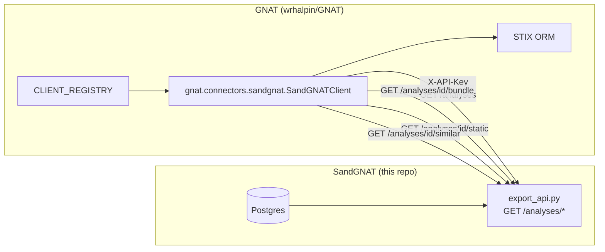

# GNAT integration: pull, not push

SandGNAT's output is consumed by GNAT — a separate threat-intel
platform in the `wrhalpin/GNAT` repo. GNAT has a unified connector
model (`ConnectorMixin`, `BaseClient`, `CLIENT_REGISTRY`) and a STIX
ORM. The SandGNAT integration is a GNAT-side connector named
`gnat.connectors.sandgnat`.

This page explains the shape of that integration and why it's
**pull** (GNAT fetches from SandGNAT over HTTP) rather than **push**
(SandGNAT writes into GNAT on completion).

## The integration seam



The connector lives in the GNAT repo; the HTTP surface lives in this
repo. They share only the contract: authentication header, endpoint
paths, JSON shapes.

## Why pull

### Decoupling

If SandGNAT pushed into GNAT, every SandGNAT deployment would need
GNAT credentials, GNAT network reachability, and fresh knowledge of
GNAT's current ingest surface. A pull makes SandGNAT a passive data
source — it doesn't know its consumers exist. Adding a second consumer
(another TIP, a notebook, an analyst's script) is a new connector,
not a new publishing pipeline.

### Schema churn lives in STIX

SandGNAT's internal schema evolves (three migrations so far). If GNAT
were coupled to our Postgres tables, every migration would break the
integration. STIX bundles ride above the schema: a `file` object has
had the same shape across all three migrations. GNAT speaks STIX
natively, so that's the natural contract.

### Reliability is simpler on the pull side

Push requires SandGNAT to handle "GNAT was unreachable when the job
finished" — a retry queue, at-least-once delivery, idempotency, a
replay endpoint for backfill. Pull handles those automatically: if
GNAT was down when a job completed, the bundle is still sitting in
SandGNAT's Postgres, and GNAT's next `/analyses?since=...` scan picks
it up.

### Security is simpler on the pull side

Push means SandGNAT holds GNAT credentials. Those credentials become a
prize if SandGNAT is compromised (which, given what SandGNAT *runs*
inside its VMs, is a concrete threat to plan for). Pull reverses the
trust direction: SandGNAT holds only an API-key that authenticates
inbound GNAT requests.

## What pull doesn't solve

Pull has real costs the design has to accept:

- **Latency.** A new completed analysis is visible to GNAT only when
  GNAT polls. For a 60-second poll interval that's up to 60 s of
  staleness. Analysts sometimes care about latency (a fresh-IOC alert
  that lands 90 s late is a real operational miss).
- **Polling load.** GNAT must rescan SandGNAT periodically. The
  `GET /analyses?status=completed&since=...` query makes that cheap,
  but the connector still hits the endpoint on a cadence.
- **No "active" signal.** SandGNAT can't proactively warn GNAT that
  "this sample you just asked about is especially interesting" — GNAT
  has to deduce it from pulled data.

For the current workload (a handful of analyses per hour, operator-in-
the-loop triage), these costs are fine. If SandGNAT scales to
thousands of detonations per hour or needs sub-minute alerting, a push
channel (or an event bus) becomes worth building.

## The GNAT-side connector

The connector in `wrhalpin/GNAT` implements GNAT's `ConnectorMixin`:

```python
class SandGNATClient(BaseClient, ConnectorMixin):
    BASE_URL_ENV = "SANDGNAT_BASE_URL"
    API_KEY_ENV = "SANDGNAT_API_KEY"

    def authenticate(self) -> None: ...
    def health_check(self) -> HealthStatus: ...
    def get_object(self, stix_type: str, object_id: str) -> STIXBase | None: ...
    def list_objects(self, **filters) -> Iterable[STIXBase]: ...
    def upsert_object(self, obj: STIXBase) -> str: ...
```

(That code is not in this repo.)

The connector's `list_objects()` walks
`GET /analyses?status=completed&since=<last_watermark>`,
downloads each analysis's bundle via
`GET /analyses/<id>/bundle`, deserializes each STIX object, and
calls GNAT's native `upsert_object()`. Lineage is preserved via a
follow-up on `GET /analyses/<id>/similar` when the analyst asks.

## What we expose, re-stated

| Endpoint                          | GNAT connector uses it to... |
|-----------------------------------|------------------------------|
| `GET /analyses`                   | discover new/changed analyses since a watermark |
| `GET /analyses/<id>`              | fetch metadata + status + fingerprint fields |
| `GET /analyses/<id>/bundle`       | fetch full STIX bundle once analysis is completed |
| `GET /analyses/<id>/static`       | fetch static findings (imports, CAPA, sections) not in STIX |
| `GET /analyses/<id>/similar`      | populate "related samples" in GNAT's UI |

See [reference/http-api.md](../reference/http-api.md) for exact
request/response shapes.

## Future: if pull isn't enough

If latency or polling cost becomes a real operational problem, the
design sketch is in the plan file
(`/root/.claude/plans/since-this-already-a-transient-wind.md`, "Phase 5
deferred" archive at the time of writing). The rough shape:

1. New Celery task `publish_to_gnat` that fires on the `completed`
   transition.
2. Pluggable `GnatClient` protocol in `orchestrator/gnat_connector.py`
   with a default stub that logs the bundle; real HTTP/gRPC adapter
   swapped in for production.
3. Keep the pull API intact (for backfill, testing, and other
   consumers).

That path isn't on the roadmap right now. Pull covers current needs.
