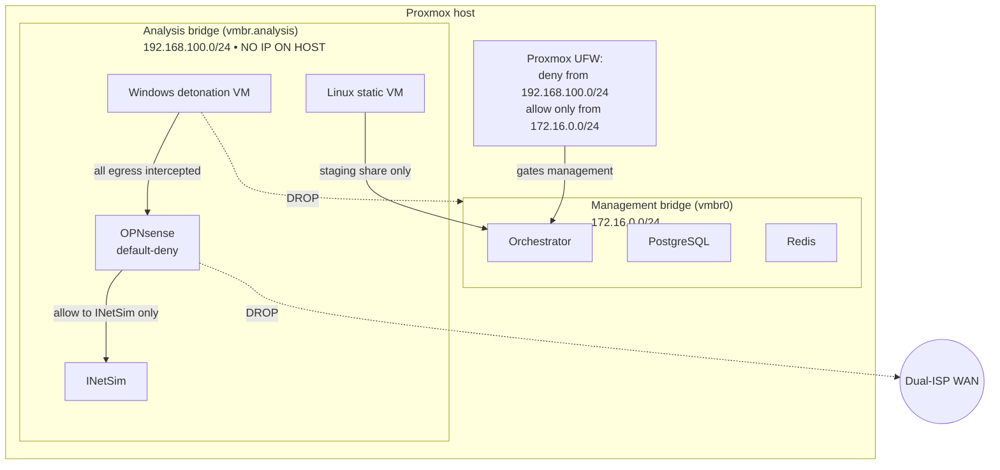

# Isolation and threat model

SandGNAT executes malware by design. The isolation model is what keeps
a live sample from pivoting into production. This page documents the
defence boundaries, the assumed threats, and the residual risks.

## What we're defending

1. **The Proxmox host.** If malware escapes the VM it runs in and
   gains host code execution, we're catastrophically lost. Protecting
   the host is the highest priority.
2. **The management network.** Our orchestrator, Postgres, Redis, and
   any operator endpoints all share a management bridge. A pivot from
   an analysis VM into management gives the attacker the sample
   corpus, IOC history, and access to external TI platforms.
3. **The public internet.** A detonating sample must not be able to
   contact real C2, exfiltrate, or participate in attacks on third
   parties. That makes us a weapon.
4. **The sample corpus.** Samples are evidence and sometimes
   confidential. Sample hashes are also sensitive — leaking them to
   VirusTotal-style services via upload tells attackers which of their
   campaigns we're studying.

## Defence layers

### 1. Network bridge topology

`vmbr.analysis` has **no IP address on the Proxmox host itself**. The
host doesn't route, NAT, or terminate any traffic from the analysis
bridge. VMs on that bridge can only talk to other things on the same
bridge — notably OPNsense (which is their gateway) and the staging SMB
share exported by the orchestrator.

The orchestrator has two NICs: one on the analysis bridge for staging
share access, one on the management bridge for everything else. This
is the only bidirectional link between the two zones and is guarded by
the orchestrator's own firewall rules.

### 2. OPNsense firewall (default-deny)

On the analysis bridge, OPNsense runs the default ruleset defined in
`infra/opnsense/`:

- **Default policy: DENY everything.**
- Allow analysis VMs → INetSim (UDP 53, TCP 80/443) so fake
  DNS/HTTP/HTTPS responses can observe C2 domains.
- Allow analysis VMs → orchestrator SMB share (TCP 445) so the guest
  can read sample bytes and write artifacts.
- Deny analysis VMs → Proxmox management network (172.16.0.0/24).
- Deny analysis VMs → WAN (both ISPs).
- Deny all multicast, broadcast, IPv6 RA.

Changes to these rules require an explicit design-doc update. Every
rule addition is a potential exfiltration channel.

### 3. Proxmox UFW

The Proxmox host enforces a final-line rule: drop any packet from
192.168.100.0/24 destined for the host itself. Even if OPNsense
misconfigures, the host stays sealed from the analysis bridge.

Management (Proxmox web UI, SSH, API) is allowed only from the
operator network (172.16.0.0/24) or via bastion.

### 4. VM-level hardening

Windows detonation VMs:

- Windows Defender **disabled** (we want to see true malware behaviour,
  not Defender's detection).
- Windows Update **disabled** (preserves the snapshot state; prevents
  clean reboots).
- UAC **disabled** (malware runs at medium integrity without prompts).
- RDP enabled but firewall-restricted to orchestrator IP only.
- Nested virtualisation disabled (shrinks the VM escape surface).

These hardening steps intentionally **weaken** the VM's defensive
posture relative to a production endpoint. The tradeoff: we get
cleaner behavioural signal from the malware at the cost of a VM that
would be catastrophic to expose to the internet. The firewall and
bridge topology are what make that tradeoff safe.

### 5. Snapshot-reset per detonation

Every Windows analysis VM is rolled back to a known-clean snapshot
after each run. Linux static VMs the same. A crashed or compromised VM
state is thrown away, not reused.

If a sample escaped the VM process and persisted to disk, the
snapshot revert erases it — unless the attack reached the hypervisor
(which is the scenario the bridge topology and host UFW guard against).

### 6. Intake-side safeguards

- **Never execute the sample on the orchestrator host.** `intake.py`
  hashes, validates, and stages bytes on disk. That's it. The only
  code that opens the sample as a program runs inside a disposable VM.
- **Never upload samples to third parties.** VirusTotal is **hash-only**
  (`vt_client.py`); YARA matches don't leave the box.
- **Quarantine is immutable.** Dropped files are moved (not copied)
  into `{QUARANTINE_ROOT}/{analysis_id}/` and the row in
  `dropped_files` is the append-only audit trail.

## Threat model

Threats we believe we mitigate:

| Threat                                         | Mitigation                            |
|------------------------------------------------|---------------------------------------|
| Sample makes real C2 connection                | OPNsense default-deny + INetSim       |
| Sample exfiltrates to WAN                      | OPNsense + host UFW                   |
| Sample pivots to management network            | Host UFW + bridge-with-no-host-IP     |
| Sample persists across runs                    | Snapshot revert after every run       |
| Sample is leaked via hash-share to VT upload   | VT client is lookup-only              |
| Orchestrator crashes leaving VM running        | VM pool heartbeat + stale lease reap  |
| Parser bug causes orchestrator RCE via PCAP    | Parsers are pure over files on the staging share; tests run them against fuzzing inputs |
| Two jobs race for the same vmid                | `vm_pool_leases` DB-backed UPSERT as lock |

Threats we **do not** claim to mitigate:

- **Hypervisor-level VM escape** (e.g. a novel QEMU/KVM vulnerability
  the sample exploits). Keep Proxmox patched, disable nested virt,
  monitor `/var/log/kern.log` for unusual KVM messages.
- **Side-channel data exfiltration** through shared cache, NIC jitter,
  or ACPI channels. We're not a classified environment.
- **Insider threats.** Anyone with analyst access can exfil samples
  manually. Access is audited but not cryptographically guaranteed.
- **Supply-chain compromise of tools we run on the orchestrator**
  (pefile, capstone, yara-python, capa). We pin versions and read the
  changelogs, but a malicious upstream patch would be bad.

## Incident response

If you suspect a sample has escaped containment:

1. **Sever the analysis bridge** at the Proxmox host level (shut down
   the bridge interface). All running VMs lose network.
2. **Stop all orchestrator services**:
   `systemctl stop sandgnat-worker sandgnat-intake`.
3. **Snapshot and preserve** the affected VM disks for forensics
   before reverting.
4. **Review the audit log**: `SELECT * FROM analysis_audit_log ORDER
   BY occurred_at DESC LIMIT 100`. Look for `quarantined`,
   `analysis_failed`, or unusual events around the suspect timeline.
5. **Check `dropped_files`**: anything that shouldn't be there?
6. **Review ProcMon captures** for hypervisor-interaction attempts —
   references to `VBOX`, `VMWARE`, `HYPER-V` strings, or calls to
   hypervisor-provided devices.
7. **Rotate all secrets** that live on the orchestrator:
   INTAKE_API_KEY, Proxmox tokens, Postgres passwords, VT API key.
8. **Reinstall** the orchestrator from a known-good image. Revert
   every analysis VM to its clean snapshot (don't keep the
   potentially-compromised clones).

## Hardening checklist (quarterly)

- [ ] Proxmox patched to latest stable.
- [ ] OPNsense ruleset diff-reviewed against `infra/opnsense/` (no
      drift).
- [ ] Host UFW rules verified: `ufw status verbose` shows deny from
      192.168.100.0/24.
- [ ] Proxmox management interface access logs reviewed for unusual
      IPs.
- [ ] `analysis_audit_log` for the period reviewed for anomalies.
- [ ] VM template clean snapshots verified (boot + take fresh capture).
- [ ] Sample corpus backup tested (restore to an isolated host).
- [ ] All dependencies (`pip list --outdated`) reviewed; high-risk
      ones (pefile, capstone, capa, yara-python) patched.
