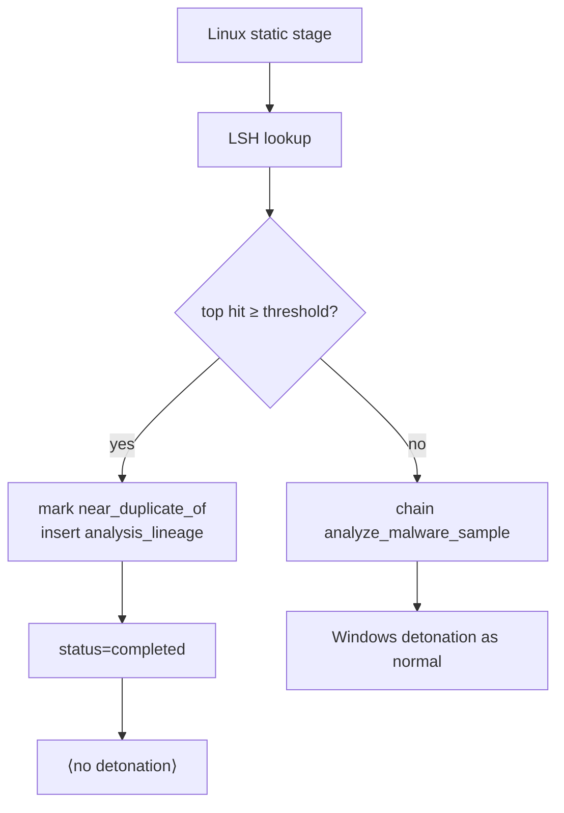

# Near-duplicate short-circuit

When the Linux static stage detects a new submission is a near-duplicate
of a prior analysis, it **skips Windows detonation entirely** and
lineage-links the new job to the parent. This page explains why that's
a reasonable thing to do, how the decision is made, and how to override
it.

## Why skip detonation

Windows detonation costs a lot:

- 3–10 min per sample (VM boot + execute + timeout window + capture export)
- 8–16 GiB of RAM reservation during that window
- Disk churn (linked clone + snapshot revert)
- Opens a kinetic outbound-traffic budget the firewall has to police

If a new submission is textually 95% identical to something we already
ran, we almost certainly already have the answer. Re-detonating
mostly discovers the same C2 indicators, drops the same files, and
burns the same resources a second time.

For a malware family that's been repacked 40 times in a campaign,
short-circuiting means we detonate the first variant and cheap-clone
the rest.

## How the decision is made

1. The static stage extracts byte and opcode trigram MinHash
   signatures (see [similarity.md](similarity.md)).
2. It runs an LSH-banded lookup against `sample_minhash_bands`, then
   computes exact Jaccard against the candidate set.
3. `short_circuit_decision(hits, threshold)` in
   `orchestrator.similarity` returns the top hit if its similarity is
   ≥ `STATIC_SHORT_CIRCUIT_THRESHOLD` (default 0.85).
4. If a hit wins:
   - `analysis_jobs.near_duplicate_of` is set to the parent's id.
   - `analysis_jobs.near_duplicate_score` is stamped.
   - `analysis_jobs.intake_decision` becomes `near_duplicate`.
   - An `analysis_lineage` row is inserted with relation=`near_duplicate`.
   - Job status is marked `completed`.
   - No Celery chain to `analyze_malware_sample`.

If no hit wins, the task calls
`analyze_malware_sample.apply_async(...)` and the Windows detonation
proceeds as usual.



## What the GNAT connector sees

`GET /analyses/<new_id>/bundle` returns a STIX bundle. For a
near-duplicate job, `export_bundle()` is called on the **new**
analysis_id; that returns an empty bundle because no STIX objects were
persisted under this id.

That's intentionally simple: bundles are keyed on `analysis_id`, and
we don't duplicate STIX rows across siblings (storage costs +
integrity headaches). The GNAT connector follows the lineage edge:

```python
# GNAT connector pseudocode
analysis = get("/analyses/{id}")
if analysis["near_duplicate_of"]:
    bundle = get(f"/analyses/{analysis['near_duplicate_of']}/bundle")
else:
    bundle = get(f"/analyses/{id}/bundle")
```

The `/analyses/<id>` payload always exposes `near_duplicate_of` and
`near_duplicate_score`, so consumers never have to guess.

## Threshold tuning

The default 0.85 is tuned for the "repacked variant" case: two
samples sharing >85% of their code-section trigrams. Lower the
threshold and you short-circuit more aggressively; raise it and you
re-detonate minor variations.

Signals that the threshold is too low (short-circuiting too much):

- Analysts asking "why didn't we detonate X?" when X's STIX bundle
  comes back sparse.
- High `near_duplicate_score` values (≥ 0.95) on samples with
  genuinely different observed behaviours (shouldn't happen in theory;
  does happen with lookalike tooling).

Signals that the threshold is too high (short-circuiting too little):

- Detonation pool is oversubscribed despite most submissions being
  obvious repacks.
- `SELECT count(*) FROM analysis_lineage WHERE relation='near_duplicate'`
  is small relative to the submission volume.

Change the threshold by env var: `STATIC_SHORT_CIRCUIT_THRESHOLD=0.90`
(pick something 0.5–0.99).

## Flavour preference

`STATIC_SHORT_CIRCUIT_FLAVOUR=byte|opcode|either` (default `either`):

- **byte** — only byte-trigram hits short-circuit. Conservative: won't
  be fooled by a sample that looks similar in disassembly but differs
  in config blobs.
- **opcode** — only opcode-trigram hits short-circuit. Robust to
  byte-level rewrites (packers, string re-encoding) but requires
  successful capstone disassembly.
- **either** — the higher score of the two wins. Broadest recall.

Most deployments want `either`. Flip to `byte` only if you've seen the
opcode pipeline produce false-positive short-circuits.

## Overriding

Three escape hatches, in order of specificity:

### Force a single submission

Submit with `force=true`:

    curl -F file=@sample.exe -F force=true \
         -H "X-API-Key: $KEY" http://localhost:8080/submit

This bypasses the sha256 dedupe check at intake. It does **not** bypass
the LSH short-circuit — if you want the full detonation on a
near-duplicate, see the next option.

### Disable short-circuit for everyone

Set `STATIC_SHORT_CIRCUIT_THRESHOLD=1.01`. Static analysis still runs
and populates the similarity tables, but no hit will ever meet the
threshold, so every submission proceeds to detonation.

### Disable static analysis entirely

Set `STATIC_ANALYSIS_ENABLED=0`. Static is skipped entirely and intake
routes directly to Windows detonation — the Phase-2 behaviour.

## Auditability

Every short-circuit writes an audit row:

    INSERT INTO analysis_audit_log (event_type='near_duplicate_short_circuit',
                                    details=jsonb_build_object('parent', ..., 'score', ...))

Reviewing the audit log is the first thing to do if a near-duplicate
link looks wrong. You'll see the score, the parent id, and the flavour
that triggered — enough to reason about the decision without replaying
the pipeline.
