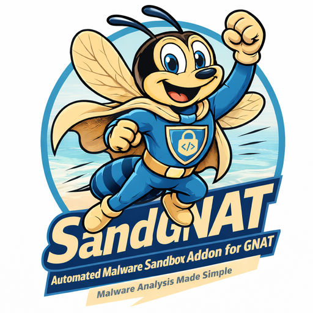

  

    
GNAT-o-sphere / malware sandbox

    <h1 style="margin-top: 0;">SandGNAT</h1>
    
Automated malware runtime-analysis environment: detonate suspicious
    binaries in isolated Windows VMs on Proxmox, cluster samples against
    the existing corpus via byte/opcode trigram MinHash, and emit STIX 2.1
    objects into PostgreSQL.

    
Source: <a href="https://github.com/wrhalpin/SandGNAT"><code>github.com/wrhalpin/SandGNAT</code></a>.

  

  

    
  

---

## Documentation

Organised with the [Diátaxis](https://diataxis.fr/) framework. Four
quadrants for four kinds of reader-intent:

|                | **Action (doing)**              | **Study (reading)**            |
|----------------|---------------------------------|--------------------------------|
| **Learning**   | [Tutorials](tutorials/)         | [Explanation](explanation/)    |
| **Working**    | [How-to guides](how-to/)        | [Reference](reference/)        |

### Start here if you're…

- **New to SandGNAT** → [tutorials/01 — Your first sample](tutorials/01-your-first-sample.md)
- **Standing up a dev stack** → [tutorials/02 — Local dev stack](tutorials/02-local-dev-stack.md)
- **Curious about the architecture** → [explanation/architecture](explanation/architecture.md)
- **Integrating the export API** → [reference/http-api](reference/http-api.md)

## What SandGNAT does, end to end

1. **Intake** (`POST /submit`) — validate, hash, dedupe against the
   existing corpus, VT hash pre-check, YARA scan, stage to SMB.
2. **Static analysis** (Linux VM, optional pre-stage) — PE/ELF parsing,
   ssdeep + TLSH fuzzy hashes, deep YARA, CAPA capability detection,
   strings + entropy, byte + opcode trigram MinHash.
3. **LSH similarity lookup** — banded-candidate fetch then exact Jaccard.
   If the best hit clears the threshold (default 0.85), skip detonation.
4. **Windows detonation** — ProcMon, tshark, RegShot, dropped-file collection.
5. **Artifact parsing → STIX 2.1** — deterministic UUIDv5 IDs, PostgreSQL
   JSONB storage.
6. **Export** — `GET /analyses/<uuid>/bundle` serves the STIX bundle to
   external consumers (the [GNAT][gnat] connector, analyst scripts, etc.).

[gnat]: https://github.com/wrhalpin/GNAT

Full architecture diagrams live in
[explanation/architecture](explanation/architecture.md) — topology,
pipeline flow, sequence, and component diagrams rendered via Mermaid.

## Key design choices

- **Isolation by default.** Analysis bridge has no host IP. OPNsense
  default-denies egress; only INetSim and staging SMB are allowed. See
  [explanation/isolation-model](explanation/isolation-model.md).
- **STIX 2.1 as the output contract.** Survives schema churn, plays
  nicely with every modern TIP. Rationale: [explanation/why-stix](explanation/why-stix.md).
- **Byte + opcode trigram MinHash + LSH bands.** Sub-linear similarity
  lookup over a growing corpus. Theory: [explanation/similarity](explanation/similarity.md).
- **Near-duplicate short-circuit.** Skip detonation when a submission is
  obviously a repacked variant of something we already analysed. Details:
  [explanation/near-duplicate-short-circuit](explanation/near-duplicate-short-circuit.md).

- **Anti-analysis evasion posture.** Catalogue of how modern malware
  detects sandboxes plus the phased mitigation plan for SandGNAT:
  [explanation/anti-analysis-evasion](explanation/anti-analysis-evasion.md).

## Status

Phases 1–6 shipped: scaffold, host↔guest detonation protocol, intake,
VM pool manager, Linux static-analysis + trigram similarity, the
read-only export API, and the anti-analysis evasion mitigations
(phases A–G). See
[explanation/anti-analysis-evasion](explanation/anti-analysis-evasion.md)
for the full implementation record.

## The GNAT-o-sphere

SandGNAT is one of three add-ons that plug into **GNAT**, the core
threat-intel platform. Every sibling emits STIX 2.1 objects and is
pulled by GNAT through a documented connector rather than writing
into its database directly.

  

    Core platform
    <h3>GNAT</h3>
    
The hub TIP. Connector abstraction, STIX 2.1 modelling, investigations, reports, and workflow automation across a large integration surface.

  

  

    Addon
    <h3>RedGNAT</h3>
    
Continuous automated red teaming — ingests threat intel, constructs adversary emulation scenarios, executes them with safety controls.

    <a class="gnat-card-link gnat-link-red" href="https://wrhalpin.github.io/RedGNAT/">Learn more</a>
  

  

    Addon
    <h3>SenseGNAT</h3>
    
Network sensor + honeypot telemetry. High-volume Kafka ingestion, Redis dedupe, automatic campaign linking back into GNAT.

    <a class="gnat-card-link gnat-link-sense" href="https://wrhalpin.github.io/SenseGNAT/">Learn more</a>
  

### Canonical Workflow

  

    

      Collect
      <strong>Telemetry &amp; Sources</strong>
      
External indicators and raw network telemetry enter the ecosystem

    

  

  
&rarr;

  

    

      Process
      <strong>GNAT</strong>
      
Ingest, normalize, convert to STIX, and route to addons

    

  

  
&rarr;

  

    

      <strong>SenseGNAT</strong>
      
Behavioral profiling &amp; anomaly detection

    

    

      <strong>SandGNAT</strong>
      
Malware detonation &amp; artifact enrichment

    

    

      <strong>RedGNAT</strong>
      
Adversary emulation &amp; validation

    

  

  
&rarr;

  

    

      Report
      <strong>Investigate &amp; Act</strong>
      
Unified investigation graph, reporting, and operator action

    

  

  <a href="https://wrhalpin.github.io/GNAT/diagram.html">View full diagram &rarr;</a>
  <a href="https://wrhalpin.github.io/GNAT/workflow.html">Read the workflow doc &rarr;</a>

Licensed under [Apache 2.0](https://github.com/wrhalpin/SandGNAT/blob/main/LICENSE).
