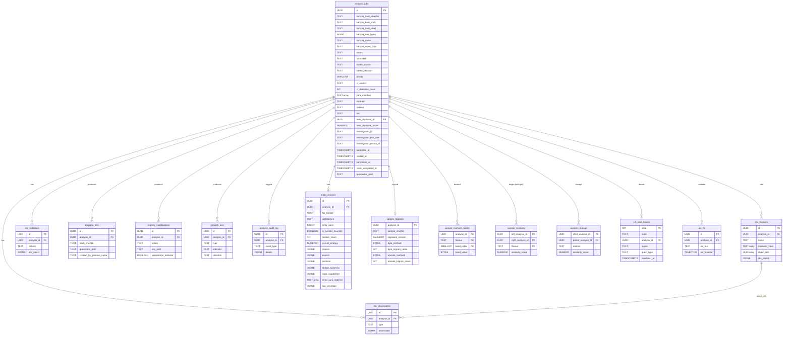
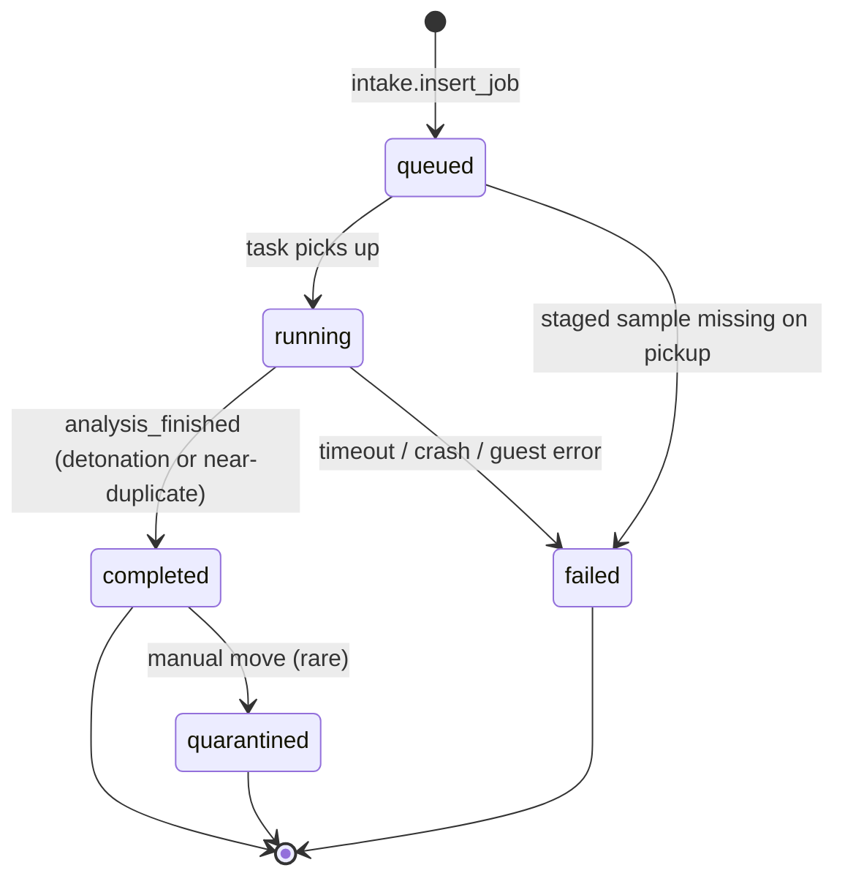

# Database schema reference

PostgreSQL 15+. All migrations in `migrations/` are forward-only; never
edit an applied migration — add a new numbered file instead.

Every table has `analysis_id` as its root foreign key. `analysis_jobs`
is the lifecycle anchor: one row per submission.

## Applying migrations

```bash
psql "$DATABASE_URL" -f migrations/001_initial_schema.sql
psql "$DATABASE_URL" -f migrations/002_intake_and_vm_pool.sql
psql "$DATABASE_URL" -f migrations/003_static_analysis.sql
```

## ER diagram



## Lifecycle states (analysis_jobs.status)



`completed` covers both paths that produce usable output:

- Detonation finished successfully and STIX was persisted.
- Near-duplicate short-circuit hit: no detonation, but
  `near_duplicate_of` points to the parent's bundle.

`failed` is anything the pipeline couldn't recover from. The audit log
has the `error` field with details.

## Table-by-table

### `analysis_jobs` (migration 001 + 002 + 003)

Lifecycle root. Every other table links back via `analysis_id`.

| Column                  | Type           | Notes                                  |
|-------------------------|----------------|----------------------------------------|
| `id`                    | UUID PK        | Generated by intake                    |
| `sample_hash_sha256`    | TEXT NOT NULL  | Canonical identity                     |
| `sample_hash_md5`       | TEXT           | Intake computes, Phase 3+              |
| `sample_hash_sha1`      | TEXT           | Intake computes, Phase 3+              |
| `sample_size_bytes`     | BIGINT         |                                        |
| `sample_name`           | TEXT           | Sanitised upload filename              |
| `sample_mime_type`      | TEXT           | mimetypes guess                        |
| `status`                | TEXT NOT NULL  | See state diagram                      |
| `submitted_at`          | TIMESTAMPTZ    | Default now()                          |
| `started_at`            | TIMESTAMPTZ    | When task picked up                    |
| `completed_at`          | TIMESTAMPTZ    |                                        |
| `duration_seconds`      | INTEGER        |                                        |
| `vm_uuid`               | UUID           | Proxmox VM UUID                        |
| `execution_command`     | TEXT           |                                        |
| `timeout_seconds`       | INTEGER        | Default 300                            |
| `network_isolation`     | BOOLEAN        | Always true                            |
| `evasion_observed`      | BOOLEAN        | Flagged if sample tried anti-VM        |
| `result_summary`        | JSONB          | Quick stats for the job                |
| `quarantine_path`       | TEXT           | Where dropped files live               |
| `submitter`             | TEXT           | `X-Submitter` header                   |
| `intake_source`         | TEXT           | `http`, `cli`, etc.                    |
| `intake_decision`       | TEXT           | queued/prioritized/duplicate/rejected/near_duplicate |
| `intake_notes`          | TEXT           |                                        |
| `priority`              | SMALLINT       | 0–9, lower = higher                    |
| `vt_verdict`            | TEXT           | malicious/suspicious/harmless/unknown/error |
| `vt_detection_count`    | INTEGER        |                                        |
| `vt_total_engines`      | INTEGER        |                                        |
| `vt_last_seen`          | TIMESTAMPTZ    |                                        |
| `yara_matches`          | TEXT[]         | Rule names from intake YARA            |
| `imphash`               | TEXT           | PE import hash                         |
| `ssdeep`                | TEXT           | Fuzzy hash                             |
| `tlsh`                  | TEXT           | Fuzzy hash                             |
| `static_completed_at`   | TIMESTAMPTZ    | When static stage finished             |
| `near_duplicate_of`     | UUID FK        | Parent analysis_id if short-circuited  |
| `near_duplicate_score`  | NUMERIC(4,3)   | 0.000–1.000                            |
| `investigation_id`      | TEXT           | GNAT investigation tag (migration 004). Opaque string, never validated against GNAT. |
| `investigation_link_type` | TEXT         | `confirmed` / `inferred` / `suggested` (CHECK constraint). Defaults to `confirmed`.  |
| `investigation_tenant_id` | TEXT         | Optional multi-tenant correlation tag. |

**Indices:** sha256, status, submitted_at DESC, priority, intake_decision, md5, yara_matches (GIN), imphash, near_duplicate_of, investigation_id (partial, WHERE NOT NULL).

### `vm_pool_leases` (migration 002 + 003)

DB-backed VM pool. Each row is one vmid in the configured range.

| Column         | Type           | Notes                                |
|----------------|----------------|--------------------------------------|
| `vmid`         | INTEGER PK     |                                      |
| `node`         | TEXT           | Proxmox node name                    |
| `analysis_id`  | UUID FK        | Current tenant, NULL when released   |
| `status`       | TEXT           | leased/released/orphaned             |
| `guest_type`   | TEXT           | windows/linux                        |
| `acquired_at`  | TIMESTAMPTZ    |                                      |
| `heartbeat_at` | TIMESTAMPTZ    | Bumped by task                       |
| `released_at`  | TIMESTAMPTZ    |                                      |

**Unique index:** `(analysis_id) WHERE status='leased'` — a job can
hold at most one active lease (across both pools).

**Acquire semantics:** conditional UPSERT with the WHERE clause as the
lock. See `persistence.PostgresPoolStore.try_acquire_lease`.

### `static_analysis` (migration 003)

One row per job. Normalised view of what the Linux static stage found.

Full schema in `migrations/003_static_analysis.sql`. The JSON columns
(`imports`, `exports`, `sections`, `strings_summary`, `capa_capabilities`,
`raw_envelope`) have GIN indices for container-ops queries.

### `sample_trigrams` (migration 003)

Per-sample MinHash signatures.

- `byte_minhash` / `opcode_minhash` — BYTEA, 128 × 4 = 512 bytes each.
- `byte_trigram_count` / `opcode_trigram_count` — cardinality of the
  underlying trigram set before MinHashing.
- `signature_version` — bump this column (and the module constant
  `orchestrator.trigrams.SIGNATURE_VERSION`) to invalidate old
  signatures.

### `sample_minhash_bands` (migration 003)

LSH band index. PK `(analysis_id, flavour, band_index)`; separate
btree index on `(flavour, band_index, band_value)` drives the
candidate-fetch query.

One row per (analysis, flavour, band_index), 16 per flavour per sample
in the default config.

### `sample_similarity` (migration 003)

Cached pairwise edges. Canonical ordering enforced:
`CHECK (left_analysis_id < right_analysis_id)`. `cache_top_edges()`
writes edges ≥ 0.5 by default.

### `analysis_lineage` (migration 003)

Explicit parent links for near-duplicate short-circuits.

| Column              | Type        | Notes                                   |
|---------------------|-------------|-----------------------------------------|
| `child_analysis_id` | UUID PK     |                                         |
| `parent_analysis_id`| UUID FK     |                                         |
| `relation`          | TEXT        | near_duplicate/reanalysis/manual_link   |
| `similarity_score`  | NUMERIC     |                                         |
| `created_at`        | TIMESTAMPTZ |                                         |

### STIX storage (migration 001)

`stix_malware`, `stix_observables`, `stix_indicators` — raw JSONB
plus extracted hot columns + GIN indices. STIX IDs are UUIDv5
derived, so `ON CONFLICT DO NOTHING` makes re-ingest idempotent.

### `dropped_files`, `registry_modifications`, `network_iocs` (migration 001)

Normalised projections of the same facts carried in STIX. They let
operators write plain SQL without unwrapping JSONB.

### `analysis_audit_log` (migration 001)

Append-only event log. Every meaningful state transition logs a row:
`sample_submitted`, `vm_spun_up`, `job_submitted_to_guest`,
`artifacts_collected`, `stix_persisted`, `quarantined`,
`near_duplicate_short_circuit`, `analysis_failed`, etc.

## Backups

Two backup classes:

1. **Postgres** — take a standard `pg_dump --format=custom`.
   PITR via WAL archiving is recommended for production; STIX bundles
   are reproducible from artifacts but the audit log is not.
2. **Quarantine storage** — immutable, append-only, separate volume.
   Back up the volume, not just the Postgres pointers. `dropped_files`
   rows without their on-disk blobs are useless.

See [how-to/backup.md](../how-to/apply-migrations.md#backing-up-before-migrations) for
the working procedure used before applying migrations in prod.
